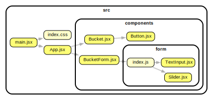

# React 🪣 List Demo

This is a demo of a React list component.

.

---

## Move Data to Local Storage

```json
[
  { "id": "1", "text": "Learn React", "importance": 1 },
  { "id": "2", "text": "Learn HTML/CSS", "importance": 2, "isCompleted": true }
]
```

Put this in your browser's local storage. Use the 🔑 'buckets' 🪣.

Then, add this **outside of your component code 💭** in `App.jsx`: `const buckets = JSON.parse(localStorage.getItem("buckets"));`
